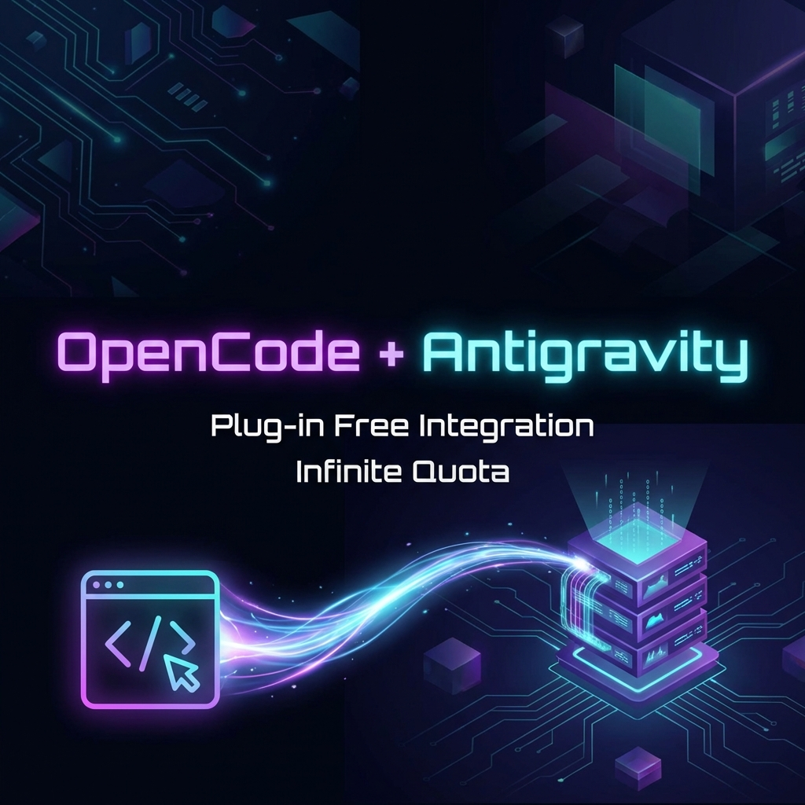

# OpenCode + Antigravity Manager Integration 🚀



> **Unlock Infinite AI Quota in OpenCode Desktop & CLI - Plug-in Free!**

This project provides a seamless, **plug-in free** configuration to integrate **OpenCode** with **Antigravity Manager**. Bypass local quota limits by routing your AI requests through Antigravity's unified account pool.

---

## 🌟 Features

- **🔌 Plug-in Free**: No complex npm packages or risky plugins. Just pure, native configuration.
- **♾️ Infinite Quota**: Automatically rotates through your Google/Claude accounts managed by Antigravity Manager.
- **⚡ High Performance**: Direct HTTP connection to your local Manager proxy (Port 8888).
- **🛠️ Zero Config**: Pre-mapped model IDs for Gemini 3 Pro, Flash, and Claude models.

---

## 🏗️ Architecture

```text
+------------------+         +---------------------------+         +-------------------+
|                  |         |                           |         |                   |
| OpenCode Desktop | ------> |                           | ------> |     Account 1     |
|                  |         |    Antigravity Manager    |         |                   |
+------------------+         |        (Port 8888)        |         +-------------------+
                             |                           |
+------------------+         |     [ PRO / FLASH ]       |         +-------------------+
|                  | ------> |                           | ------> |     Account 2     |
|   OpenCode CLI   |         |    [ Token Rotation ]     |         |                   |
+------------------+         +---------------------------+         +-------------------+
```

---

## 🚀 Quick Start (Windows)

### Prerequisites
1. **Install [OpenCode](https://opencode.ai)** (Desktop & CLI).
2. **Install [Antigravity Manager](https://antigravity.tools)** and ensure it is running (Port 8888).
   - *Tip: Get [Antigravity Manager Supreme](https://antigravity.tools) for advanced features!*

### Installation
Run this simple command in PowerShell to automatically configure OpenCode:

```powershell
.\release\install.ps1
```

**That's it!** Restart OpenCode and enjoy your new models.

---

## 📋 Manual Installation

If you prefer to configure manually:

1. **Locate your config**: `~/.config/opencode/opencode.json` (Create if missing).
2. **Copy the Config**: Paste the contents of [`release/opencode.json`](release/opencode.json) into your file.
3. **Restart OpenCode**.

---

## 🛡️ Troubleshooting

### "Service Unavailable" / "Token Error"
If you see errors like `Token error: All accounts are currently...`:
1. Open **Antigravity Manager Dashboard**.
2. Go to **Accounts**.
3. **Delete and Re-Add** all your Google accounts (Refresh is sometimes insufficient).
4. Verify one account works in the Manager's own playground.

---

## 📦 What's Included?

- `release/opencode.json`: The magic configuration file.
- `release/install.ps1`: Automated installer.

---

## 🔗 Links

- **[OpenCode](https://opencode.ai)** - The open-source AI code editor.
- **[Antigravity Manager](https://antigravity.tools)** - The ultimate account management tool.
- **[Support / Supreme Access](https://antigravity.tools)** - Support the project!

---

*Note: This configuration is a community integration and requires your own Antigravity Manager setup.*
